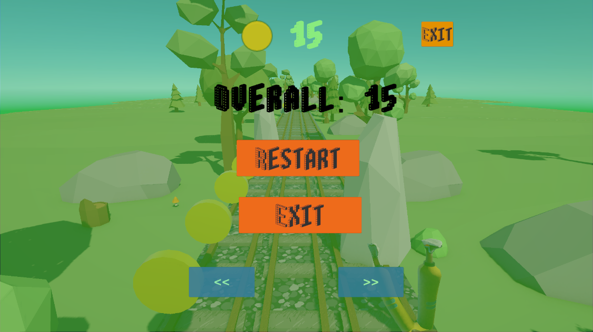

\#FunRun

Endless runner mini-game, created in Unity 6

\##About Project

A runner game made by tutorial in you-tube and refined for the portfolio by myself: added chunks with various

decorations and a menu featuring an animated character.

\##Controls

\- Left arrow / onscreen "<<" button — switch lanes to the left

\- Right arrow / onscreen ">>" button — switch lanes to the right

\## Features Implemented

\- Endless running with lane-switching mechanics

\- Coin collection and scoring system

\- Game Over and high score system 

\- Menu scene featuring an animated character 

\- 3 track segment variations with distinct scenery, transitioning smoothly

\- Audio: lane switching, collisions, coin collection, and background music

###Screenshots

##Main Menu

##Gameplay

##Game over screen

\##Technologies

\- Unity 6 (6000.3.20f1)

\- C#

\- URP (Universal Render Pipeline)

\## How to run

1\. Clone the repository.

2\. Open the project in Unity 6 (6000.3.20f1 or later).

3\. Open the `Assets/Scenes/MainMenu` scene.

4\. Press Play.

\## Links

